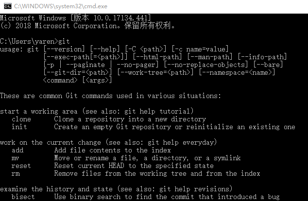
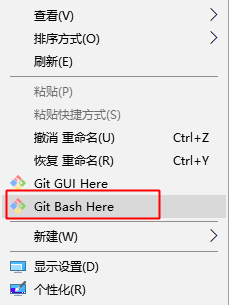
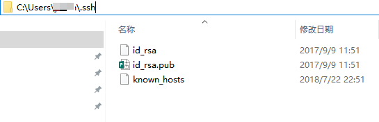
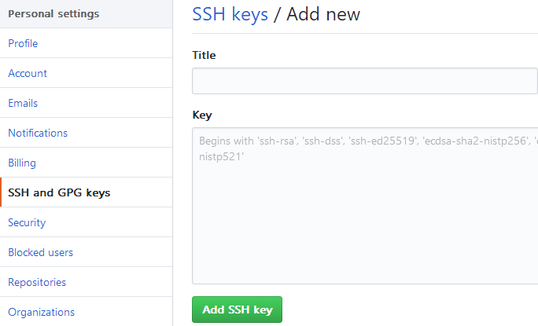

# GitTutorial


## 本文为博主原创文章，如需转载，请在醒目位置注明出处

# 前言

Android 开发中常用的版本控制工具就是 `Git`。商业项目大多使用 `Git Server` + `Git Client` + `Gerrit` + `Jenkins` 搭建代码审核及持续集成系统。个人开源项目大多托管在 `GitHub` (免费 Git 服务器)。所以，本文以 `GitHub` 为例，简述 `Git` 账户配置及命令行中 `Git` 命令别名配置。

#  1. 安装 Git for windows

先下载 [Git for windows](https://github.com/git-for-windows/git/releases/tag/v2.14.1.windows.1)，然后安装。安装结束后，按 Win + R 键，输入 cmd 打开命令行窗口，输入 git 回车，看是否有如下提示：



没有的话，需要将 `D:\Program Files\Git\cmd` （替换为你自己的文件路径）配置到环境变量中。这样就可以在 windows cmd 中使用 git 命令，否则只能右键打开 Git Bash，在 Git Bash 中使用 Git 命令。



# 2. 远程登录授权

Git 使用 SSH 协议验证和登录远程服务器，所以首先需要生成 SSH Key，并把 Public Key 添加到 GitHub 账户。

## 2.1 生成 SSH Key

按 Win + R 输入 cmd，打开命令行，输入以下命令，然后回车：

`ssh-keygen -t rsa -b 4096 -C "your_email@example.com"`

检查是否生成：



## 2.2 添加 id_rsa.pub 到 GitHub

用记事本打开 id_rsa.pub，将文件中所有内容复制到下图所示位置并保存：

- 

## 2.3 测试连接

- `ssh -T git@github.com`

## 3. 配置用户名和邮箱

[] 表示参数可选，--global 表示所有项目都使用这个邮箱提交代码，而不加这个参数，则可以为不同项目配置不同的邮箱。

- `git config [--global] user.name "your_name"`
- `git config [--global] user.email your_email@example.com`

查看配置：

- `git config --list`

## 4. 配置 Git Bash 中 Git 命令别名

配置命令别名后，只用敲 git co 就可以代替原来的 git checkout，省事不少。

- 敲 cls 清屏：编辑‪`D:\Program Files\Git\etc\profile.d\aliases.sh`，添加`alias cls='clear'`

- git 常用命令别名配置：

```
git config --global alias.st status
git config --global alias.co checkout
git config --global alias.ci commit
git config --global alias.br branch
git config --global alias.last 'log -1'
git config --global alias.lg "log --color --graph --pretty=format:'%Cred%h%Creset -%C(yellow)%d%Creset %s %Cgreen(%cr) %C(bold blue)<%an>%Creset' --abbrev-commit"
```

## 5. Git 使用教程

可以参考 [廖雪峰的Git教程](https://www.liaoxuefeng.com/wiki/0013739516305929606dd18361248578c67b8067c8c017b000)，通俗易懂。
